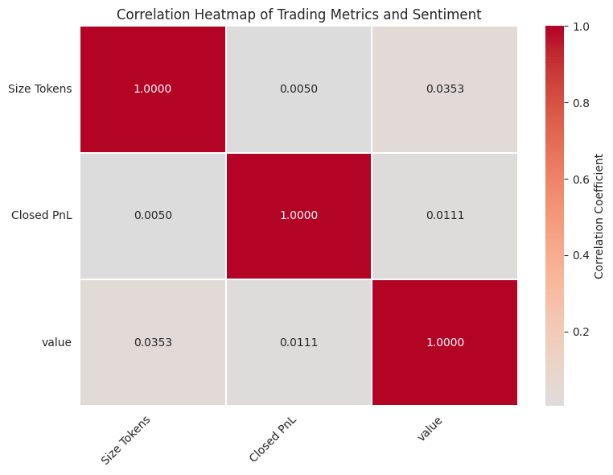
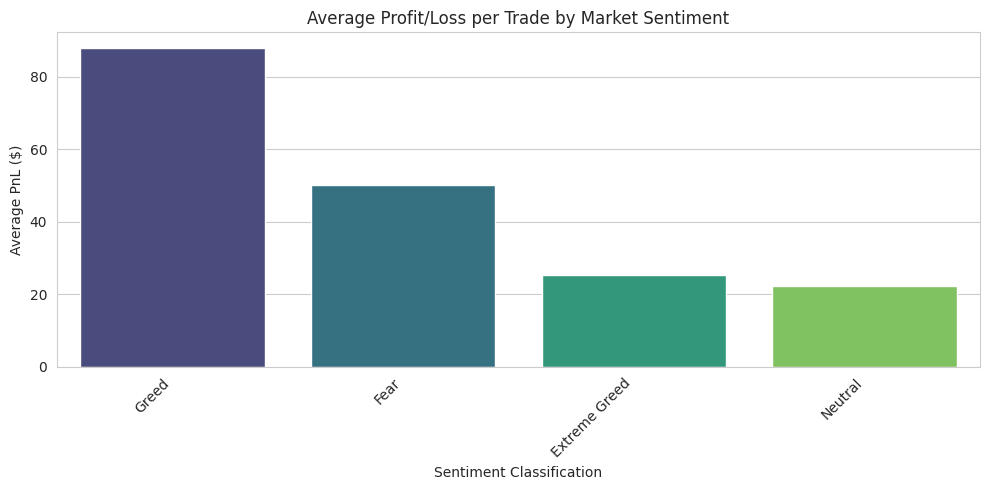
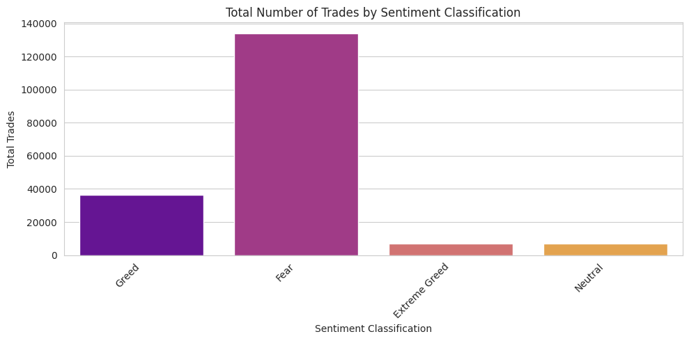
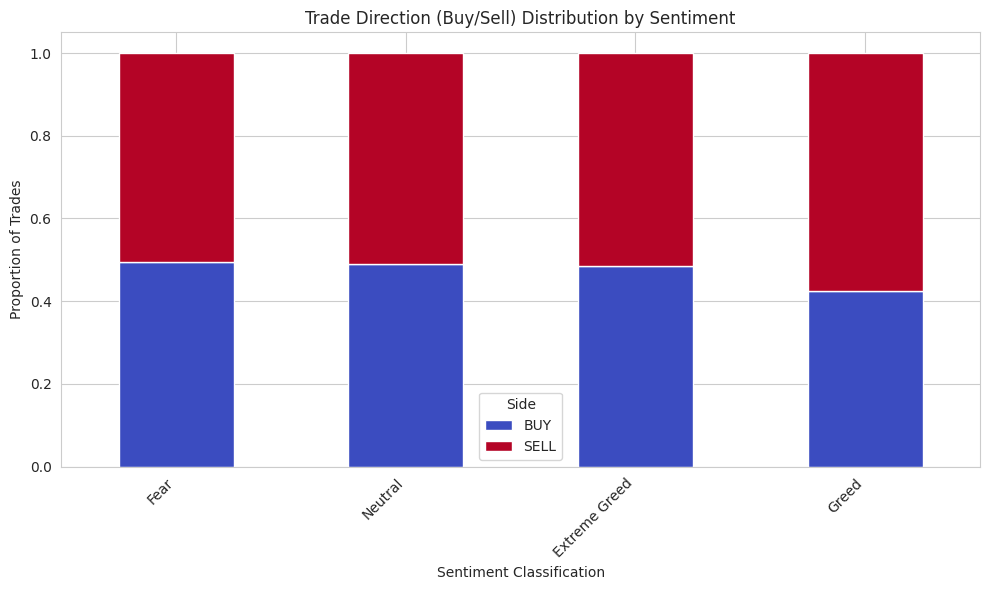
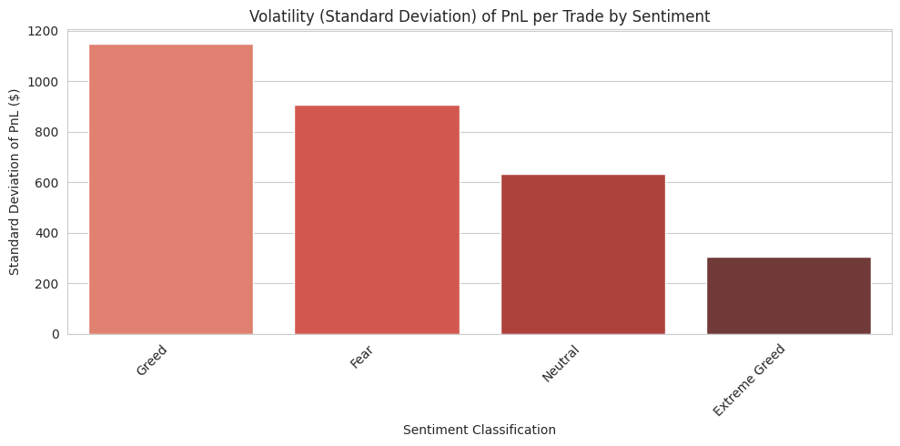
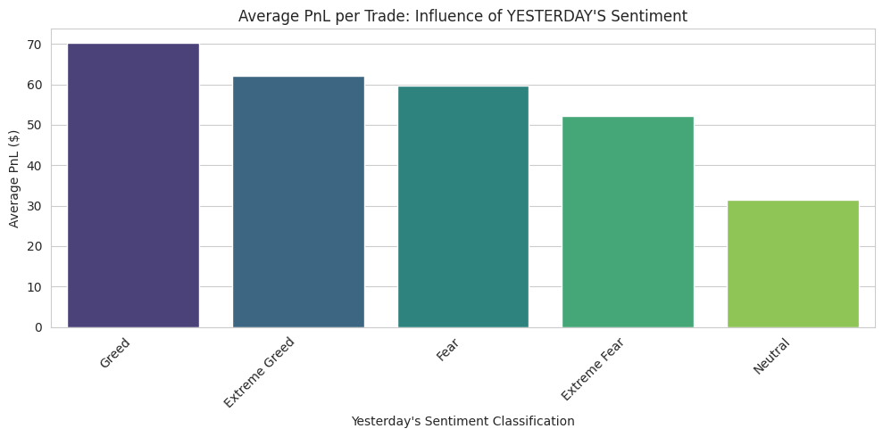
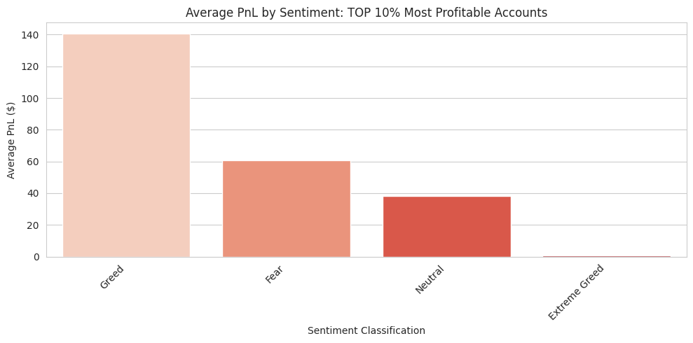
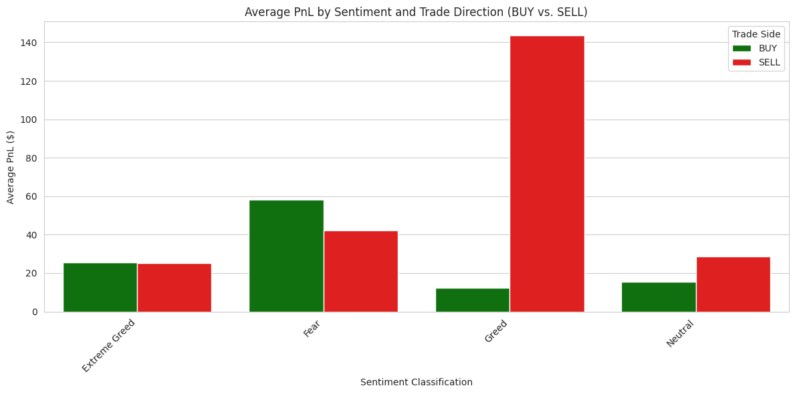

# Hyperliquid Trader Data Analysis

---

## 📖 Table of Contents

- [Project Objective](#project-objective)
- [Tools and Technologies](#️-tools-and-technologies)
-  [Directory Structure](#Directory-structure)
-  [Setup and Execution](#Setup-and-Execution)
-  [Google Colab Notebook](#Google-Colab-Notebook)
-  [Data Sources and Methodology](#Data-Sources-and-Methodology)
-  [Key Findings and Recommendations](#key-findings-and-recommendations)
-  [Key Visuals](#️visuals)
-  [Author and Contact](#-author-and-contact)

---
## Project Objective

To analyze how trading behavior (profitability, risk, volume) aligns or diverges from overall market sentiment (Fear vs. Greed) and to identify hidden trends or signals that influence smarter trading strategies.

---

## 🛠️ Tools and Technologies

| Category | Tools & Libraries Used |
| :--- | :--- |
| **Programming** | Google Colab |
| **Data Extraction \& Storage**| Direct link and file ID, **Pandas** (read csv file)
| **Data Processing** | **Pandas** (Data Cleaning, Transformation), **SQL** (Database Queries) |
| **EDA & Reporting** |  **Matplotlib/Seaborn** (Heatmap, barplot, side_percentage, ) |
| **Version Control** | Git & **GitHub** |

---

## Directory Structure

The structure of submission is 

```bash
ds_Jayesh_Sanjay_Patil/

├── notebook\_1.ipynb             # Google colab notebook
├── csv\_files/                   # (Data Provided)
├── outputs/                     # (Graphs)
├── ds\_report.pdf                # Finalreport
└── README.md                    # Project setup, execution instructions, and notes

```
---

## Setup and Execution
Steps followed throughout the project

---

### Google Colab Notebook

All data loading, cleaning, analysis, and visualization code is contained within the notebook\_1.ipynb file.

**Google Colab Link:**[https://colab.research.google.com/drive/1u2vj0IOreGYvCJcqFhrYrZhMS3H8UFf_?usp=sharing](https://colab.research.google.com/drive/1u2vj0IOreGYvCJcqFhrYrZhMS3H8UFf_?usp=sharing)

---

### Data Sources and Methodology

Datasets: Bitcoin Market Sentiment Dataset (Fear \& Greed Index) and Historical Trader Data from Hyperliquid.

Methodology Highlights: The analysis involved date standardization, PnL volatility as a risk proxy, Lagged Sentiment Analysis (T-1), and Account Segmentation to isolate 'Smart Money' behavior.

---

### Key Findings and Recommendations

The final analysis confirms that profitability is maximized by operating as a contrarian: SELL trades during Greed yield the highest average PnL in the dataset.

The mention leverage column is missing from the dataset which is restricting the further analysis
---

---

## Visuals

The visuals generated for analysis are, 

### Heatmap


| Visual Output | Description |
| :--- | :--- |
|**Heatmap**| Corerelation of 0.035295 between Volume (Size tokens) and Sentiment (Value) implies that there is an weak positive Correlation between variables implying very less effect of sentiment on the volume.|
|   |Corerelation of 0.011132 between PnL and Sentiment (Value) implies that there is too weak positive correlation between variables,Profitability is not linearly tied to Fear and greed.|

### Average Profit by sentiment graph


| Visual Output | Description |
| :--- | :--- |
| **Bar Plot**|The highest average profitability per trade is observed during **Greed** Phase with avearge profit of $87.89 per trade.|

### Total Number of Trades by Sentiments



| Visual Output | Description |
| :--- | :--- |
| **Bar Plot**|The highest trades during the Fear implies that the traders panically selling the trades during this period to minimize the losses|


### Trade decision by Sentiment


| Visual Output | Description |
| :--- | :--- |
| **Stacked Bar Plot**|The equal seller and buyer (approximately 0.5) for both fear and extreme greed implies that the traders are equally spread between buying the dip or extreme peak and panic selling|
|   |The bias towards SELL Greed suggests that traders on average, tend to use this period as an profit making period by selling.|


### Volatility Per Trade by Sentiment


| Visual Output | Description |
| :--- | :--- |
| **Bar Plot**|The Standard deviation for Greed induces the highest trading risk among, resulting in the widest dispersion of PnL outcomes.|
|   |Extreme Greed has lowest standard deviation implying cautious behavior when the market is at extreme peak.|

### Average PnL per Trade by Yesterday's Sentiment


| Visual Output | Description |
| :--- | :--- |
| **Bar Plot**| The highest bars for the yesterdays Greed and extreme greed implies that the todays profit will be higher if the last days (yesterdays) sentiment is greed or extreme greed.|


### Average PnL by Sentiment: TOP 10% Most Profitable Accounts


| Visual Output | Description |
| :--- | :--- |
| **Bar Plot**|The highest profit are collected during the period of greed where buyer may be taking the profitabe short position.|
|   |The lowest profit for extreme greed period implies buyer are highly inactive or observe the trade closely during this period without booking any profit or loss during this period.|

### Average PnL by Sentiment and Trade Direction (BUY vs. SELL)


| Visual Output | Description |
| :--- | :--- |
| **Side by Side Bar Plot**|The graph shows the tendency of the buyers with Very high sell bar during the greed and high buying during the period of of fear or dip.|

---

## 📧 Author and Contact

**Author:** Jayesh Sanjay Patil

**LinkedIn:** https://www.linkedin.com/in/jayesh-patil-83085521a

**Email:** jayeshpatil7530@gmail.com

---